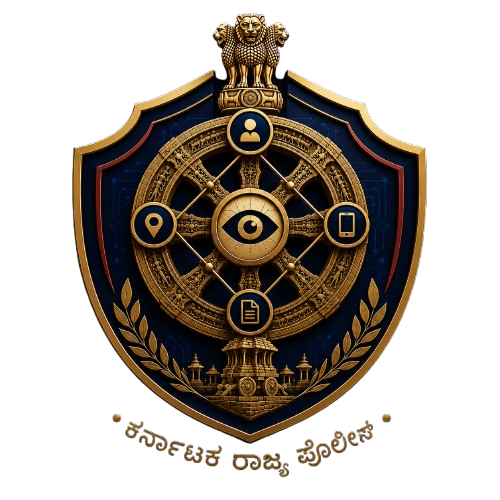

# TALAARI (ತಳವಾರ) — AI Investigation Console

<p align="center">
  
</p>

<h3 align="center">
  <b>KARNATAKA STATE POLICE DATATHON 2026 — CHALLENGE 1 SUBMISSION</b>
</h3>

<p align="center">
  <b>A Production-Grade, Explainable AI Crime Intelligence & Forensic Investigation Platform</b><br />
  <i>Empowering Karnataka State Police Officers with Native Bilingual (English / ಕನ್ನಡ) Crime Analytics, Entity Link Graphs & Automated Prosecution Reporting</i>
</p>

<p align="center">
  
  
  
  
</p>

---

## 📑 Executive Summary

**TALAARI (ತಳವಾರ)** — named after the historic Karnataka state security guardians — is a state-of-the-art AI-assisted investigation and digital forensics platform engineered for the **Karnataka State Police (KSP)**.

Built on **Zoho Catalyst serverless cloud infrastructure** and modern web technologies, TALAARI transforms unstructured crime records, complex FIR filings, forensic evidence assets, CCTV dump data, and Call Detail Records (CDRs) into actionable, explainable crime intelligence.

Officers can discover hidden crime networks, analyze spatial crime hotspots, track evidence through immutable custody logs, collaborate with an interactive AI Copilot, and automatically compile court-ready official prosecution dossiers (**KSP Form No. 76A**).

---

## 🎯 Alignment Matrix with Problem Statement

| # | Problem Statement Requirement | TALAARI Feature Implementation |
|---|---|---|
| **1** | **Conversational Crime Intelligence Interface** | **TALAARI Copilot & Voice Telemetry**: Bilingual natural language querying interface with context-aware investigation briefings and voice prompt synthesis. |
| **2** | **Criminal Network & Relationship Analysis** | **Interactive Knowledge Graph**: SVG visual relationship engine connecting suspects, victims, phone numbers, vehicles, bank accounts, and locations with drag & zoom controls. |
| **3** | **Crime Pattern & Trend Analytics** | **Spatial Intelligence Radar**: Interactive jurisdiction crime heatmaps, hotspot detection, and modus operandi cluster analysis across Bengaluru Metropolitan limits. |
| **4** | **Sociological Crime Insights** | **Demographic & Behavioral Roster**: Tracks offender age, socio-economic risk factors, injury states, and crime category distribution. |
| **5** | **Criminology-Based Offender Profiling** | **Heinous Crime Alert Engine**: Automated gravity scoring (`HEINOUS`, `HIGH`, `NORMAL`), repeat MO matching, and suspect state tracking. |
| **6** | **Investigator Decision Support** | **AI Discovery Feed & Officer Briefings**: Autonomous reasoning feed recommending next investigative steps with explicit confidence scores (`96% Conf.`). |
| **7** | **Financial Crime & Link Analysis** | **Cyber Crime & Mule Account Pipeline**: OCR extraction for bank statements, RTGS transaction numbers, IMEI signals, and mule account dispersal maps. |
| **8** | **Crime Forecasting & Early Warning** | **Jurisdiction Hotspots Radar**: Real-time patrol alert feed and vehicle intercept warnings (e.g., SUV KA-01-MJ-8891 pattern match). |
| **9** | **Explainable AI & Transparent Analytics** | **Human-in-the-Loop Review Pipeline**: Every AI-extracted entity/relationship displays confidence metrics and requires officer Accept/Reject audit logs before commitment. |
| **10** | **Secure Access & Governance** | **KGID Officer Dossier & Audit Stream**: Role-based access (Investigating Officer vs. DSP Supervisor) with immutable, timestamped custody logs and KGID security clearances. |

---

## ✨ Key Features & Core Operational Modules

```
 ┌─────────────────────────────────────────────────────────────────────────────┐
 │                         TALAARI OPERATIONAL ARCHITECTURE                     │
 └─────────────────────────────────────────────────────────────────────────────┘
                                       │
  ┌───────────────────┬────────────────┼───────────────────┬──────────────────┐
  ▼                   ▼                ▼                   ▼                  ▼
[Command Center]   [Case Files]  [Evidence Vault]    [AI Intelligence]   [Report Console]
 • Spatial Radar   • FIR Management • Custody Pipeline  • OCR & NER Engine   • KSP Form 76A
 • AI Feed         • Suspect Roster • SHA-256 Hashes    • Knowledge Graph    • JSON / Print
 • Tactical Queue  • Journal Notes  • Media Preview     • Timeline Audit     • English/ಕನ್ನಡ
```

### 1. 🛡️ Investigation Command Center
- **Mission Control Dashboard**: Live tactical feed presenting shift parameters, system engine statuses (Catalyst DB, OCR Engine, GNN), active dockets, and critical FIR alerts.
- **Spatial Intelligence Radar**: Map-based crime cluster analysis showing evidence coordinates, crime hotspots, and incident geography.
- **Autonomous AI Discovery Feed**: Real-time intelligence feed flagging IMEI overlaps, vehicle MO matches, and suggested officer actions with explicit reasoning trails.

### 2. 📁 Case Management Workspace
- **Relational FIR Parameters**: Full lifecycle management of FIR files including Crime Number, Station Unit, Major/Minor Crime Heads, Incident Duration, and GPS Coordinates.
- **Suspect & Victim Roster**: Structured tracking of complainants, victims, and accused persons with injury levels, contact details, and custody states.
- **Officer Journal Notes**: Time-stamped, searchable investigation logbook with full edit/delete audit capabilities.

### 3. 🔐 Evidence Vault & DEMS (Digital Evidence Management System)
- **Forensic Asset Management**: Ingest digital files, documents, CCTV videos, mobile dumps, and physical forensic assets.
- **Chain of Custody Tracking**: Immutable handover tracking recording securing officer, GPS collection coordinates, handover remarks, and status transitions (`Secured in Locker`, `In Transit`, `Submitted to Court`).
- **Cryptographic Integrity**: SHA-256 hash generation and file metadata validation to prevent evidence tampering.

### 4. 🧠 AI Intelligence & Entity Extraction Pipeline
- **Bilingual OCR & NER**: Provider-agnostic OCR engine capable of extracting text from Kannada and English document scans.
- **Named Entity Extraction**: Automated identification of 10 entity types (`PERSON`, `PHONE`, `VEHICLE`, `ADDRESS`, `EMAIL`, `ORGANIZATION`, `DATE`, `TIME`, `CURRENCY`, `IDENTITY_NUMBER`).
- **Human-in-the-Loop Governance**: Interactive Accept/Reject review workflow allowing investigating officers to validate AI inferences before saving to the database.

### 5. 🕸️ Interactive Knowledge Graph
- **Entity Link Discovery**: Dynamic SVG graph visualizing complex networks between suspects, phone numbers, vehicles, financial accounts, and crime scenes.
- **Visual Controls**: Full pan, zoom, drag, and node highlighting to trace multi-case criminal syndicates.

### 6. ⏱️ Chronological Case Timeline
- **Unified Event Log**: Chronologically merged timeline combining FIR registration events, officer journal entries, custody handovers, and AI review decisions.
- **Filter Matrix**: Filter by event type (`CASE_EVENT`, `NOTE_EVENT`, `EVIDENCE_EVENT`, `REVIEW_EVENT`).

### 7. 📄 Official Prosecution Reports (KSP Form No. 76A)
- **Government Report Dossier**: Formatted according to Karnataka State Police official specifications, featuring the State Emblem of Karnataka, bilingual headings, and verification QR code.
- **Dual Export Options**: 1-click **JSON Data Export** and **Court-Ready Print / PDF Engine** with clean pagination and background watermark.

### 8. 🌐 Full Native Kannada Localization (ಕನ್ನಡ)
- **100% Bilingual Coverage**: Instant runtime toggle between English and Kannada across every UI component, modal, table, notification, and status badge.
- **Noto Sans Kannada Typography**: Integrated Google `Noto_Sans_Kannada` font engine ensuring crisp, authentic Kannada script rendering.

---

## ☁️ Zoho Catalyst Cloud Architecture

TALAARI is designed natively for deployment on the **Zoho Catalyst** serverless ecosystem:

```
                  ┌────────────────────────────────────────┐
                  │          ZOHO CATALYST PLATFORM        │
                  └────────────────────────────────────────┘
                                      │
         ┌────────────────────────────┼────────────────────────────┐
         ▼                            ▼                            ▼
 [Client Hosting / Slate]     [Serverless Functions]        [Data Store & Zia]
  • Next.js Static Export      • Node.js API Functions       • NoSQL Case Data
  • CDN Distribution           • Knowledge Graph Builders    • Zia OCR & SmartBrowz
  • Fast Edge Delivery         • Entity Roster Engines       • File Store Assets
```

- **Client Hosting (Slate)**: Static bundle exported via Next.js `output: "export"` served globally via Catalyst CDN.
- **Data Store**: Relational schema mapping FIR records, forensic assets, custody logs, and user credentials.
- **File Store**: Encrypted storage for uploaded forensic media and scanned PDFs.
- **Offline / Local Simulation Mode**: Built-in mock provider fallbacks ensure the application functions seamlessly even during offline local demonstrations.

---

## 📸 User Interface & Aesthetics

Designed with a **Police Command Center** aesthetic:
- **Official KSP Gold Emblem & Seal Integration**
- **High-Contrast Dark Mode & Daylight Command Mode**
- **WCAG 2.1 Accessible Focus States & High Contrast Badges**
- **Tabular Mono Typography for KGID, FIR Numbers, Hashes, and Coordinates**

---

## 🚀 Quick Start & Development Setup

### 1. Prerequisites
- **Node.js**: v18.0.0 or higher
- **npm**: v9.0.0 or higher

### 2. Installation
```bash
# Clone the repository
git clone https://github.com/HithaishiSP2004/ksp-investigation-copilot.git
cd ksp-investigation-copilot/frontend

# Install dependencies
npm install
```

### 3. Environment Configuration
Create a `.env.local` file in `frontend/`:
```env
NEXT_PUBLIC_CATALYST_PROJECT_ID="mock_project_id"
NEXT_PUBLIC_CATALYST_CLIENT_ID="mock_client_id"
NEXT_PUBLIC_CATALYST_AUTH_DOMAIN="mock_auth_domain"
```
*(Leave default or mock values to run in offline local simulation mode).*

### 4. Run Development Server
```bash
npm run dev
```
Open [http://localhost:3000](http://localhost:3000) in your browser.

---

## 🔑 Test Credentials (Local Simulation Mode)

| Parameter | Credential | Role |
|---|---|---|
| **KGID Number** | `123456` | Investigating Officer (Inspector) |
| **Password** | `password` | Secure Password |
| **Quick Demo** | Click **"Quick Demo Access"** on login page | Instant Authorization |

---

## 📦 Deployment to Zoho Catalyst (Slate)

### Option A: Direct Zip Upload (Recommended for Hackathon Evaluation)
1. The pre-built, verified production bundle is located at:
   ```
   talaari-deploy.zip (5.29 MB)
   ```
2. Log in to **Zoho Catalyst Console** → **Client Hosting** → **Slate**.
3. Click **Deploy By Direct Upload**.
4. Upload `talaari-deploy.zip` and click **Deploy**.

### Option B: Build from Source
```bash
# Navigate to frontend
cd frontend

# Generate production static export
npm run build

# The output folder `out/` is ready for deployment
```

---

## 🧪 Demo Guide for Hackathon Judges (5-Minute Walkthrough)

1. **Sign In**: Enter `KGID: 123456`, click **Sign In**. Observe the official KSP emblem and bilingual header.
2. **Language Toggle**: Click **ಕನ್ನಡ (KN)** in the top bar. Notice how the entire Command Center, labels, table headers, and status badges instantly transition into native Kannada script.
3. **Command Center**: Review the **Spatial Intelligence Radar** (heatmaps) and the **AI Discovery Feed** (flagged IMEI overlaps & SUV alerts).
4. **Open Case File**: Click **"Open Case Workspace"** on the active FIR `FIR-2026-00892`. Explore Brief Facts, Victims, Suspects, and the Officer Journal Notes.
5. **Inspect Evidence Vault**: Click **Evidence Store** in the sidebar. Click `EVD-2026-0001` (CCTV Footage). Run **"Analyse with AI"** to see extracted OCR text, entity roster, and confidence scores.
6. **Knowledge Graph**: Click **TALAARI Copilot** in the sidebar to visualize interactive suspect-vehicle-phone relationship links.
7. **Generate Report**: Click **Report Console** → click **Print Report** to preview the official **KSP Form No. 76A** dossier or click **Export JSON**.
8. **Officer Profile**: Click the profile icon in the sidebar footer to view the **Officer Security Dossier Modal** with clearance levels and mode toggles.

---

## 🏆 Submission Summary & Quality Verification

- **TypeScript Compiler**: `0 Errors` (`npm run build` verified)
- **ESLint Status**: Clean compilation
- **Localization Coverage**: `100%` (English & Kannada keys fully mapped)
- **Responsive Layout**: Desktop Command Center & Mobile Field Support
- **Repository**: [GitHub Repository](https://github.com/HithaishiSP2004/ksp-investigation-copilot)

---

<p align="center">
  <b>Developed for Karnataka State Police Datathon 2026</b><br />
  <i>TALAARI (ತಳವಾರ) — Safeguarding Justice through Explainable AI Intelligence</i>
</p>
